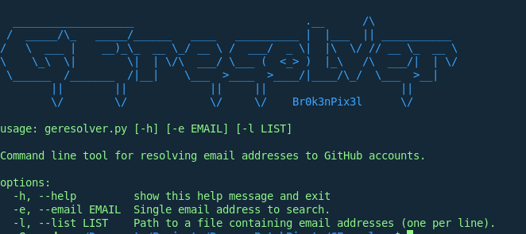
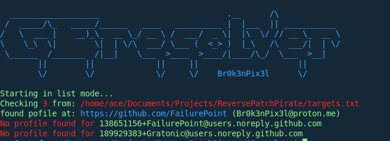

# GEresolver
 OSINT/Recon tool for resolving emaill addresses to connected GitHub accounts. (PatchPirate, but backwards....)

GEresolver is the sister project to [PatchPirate](https://github.com/FailurePoint/PatchPirate) and is a Recon/OSINT software for levereging the GitHub API to link GitHub profiles to already discovered email addresses from either a single address, or from a target list.

## Instalation and use
Requires python 3.11+ with pip.

To install PatchPirate on Linux run: `git clone https://github.com/FailurePoint/GEresolver.git & cd GEresolver & python3 -m pip install -r requirements.txt`
To run it, from the folder it is installed in run: `python3 geresolver.py`

## Usage
### Single email
navigate to the folder containing the script and run:
`python3 geresolver.py -e example@example.com`

### Target list
create your `target.txt` file then navigate to the containing folder for the script and run `python3 geresolver.py -l /full/path/to/targets.txt`
the target file should contain a list of emails (one per line) to be scanned.

## Screenshots

